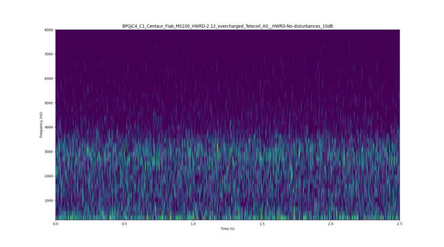
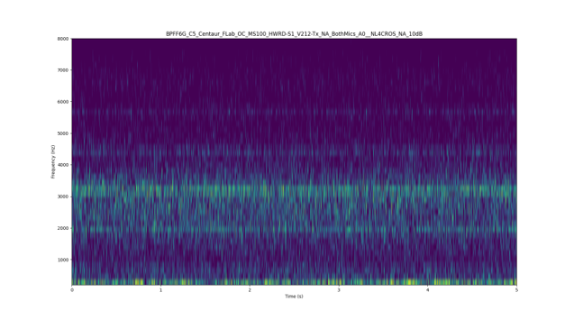

# Audio Artifacts Detection ML Project
## Table of Contents

- [About The Project](#about-the-project)  
- [Training](#training)
- [Results](#results)
- [Contact](#contact)  

## About The Project

This project prototypes a **machine learning model to detect audio artifacts** from hearing aid test measurements. 

Audio artifacts are undesired sounds originating from within the device that appear at the output signal independently of the input audio. They are generated by the device’s internal electronics as a byproduct of their operation. A primary cause of these artifacts is the use of a shared power supply between the audio engine and other electronic components, which introduces interference into the audio signal path.

*Figure 1: Example of no artifact recording.*

*Figure 1: Example of clearly visible artifact in recording.*

## Training
The final training approach involved fine-tuning the models on 5-second audio segments with a 0.25 overlap, using an augmented training dataset. Due to the periodic nature of the audio artifacts, a 5-second window was sufficient to capture the full temporal context.

Training was performed on the AzureML platform using an NVIDIA A100 GPU. The models were trained on real production audio samples (private data); therefore, the original dataset cannot be publicly released. 

(<a href="#readme-top">back to top</a>)

## Results
The obtained results are promising and the model will be further evaluated in a production environment for upcoming hearing aid platforms.

| Model           |  F1-score  |  Precision  |  Recall  |    AUC   |
| --------------- | ---------- | ----------- | -------- | -------- |
| Wavegram-logmel |   0.9532   |   0.9641    |  0.9426  |  0.9862  |
|    Resnet54     |   0.9466   |   0.9918    |  0.9053  |  0.9900  |      

## Further considerations
Future work will focus on exploring attention-based detection mechanisms, and investigating a hybrid architecture combining the wavegram approach with attention modules.

(<a href="#readme-top">back to top</a>)

<!-- CONTACT -->
## Contact

Jedrzej Ogrodowski

(<a href="#readme-top">back to top</a>)

[contributors-shield]: https://img.shields.io/github/contributors/OgrodowskiJedrzej/audio-artifacts-classification.svg?style=for-the-badge
[contributors-url]: https://github.com/OgrodowskiJedrzej/audio-artifacts-classification/graphs/contributors
[forks-shield]: https://img.shields.io/github/forks/OgrodowskiJedrzej/audio-artifacts-classification.svg?style=for-the-badge
[forks-url]: https://github.com/OgrodowskiJedrzej/audio-artifacts-classification/network/members
[stars-shield]: https://img.shields.io/github/stars/OgrodowskiJedrzej/audio-artifacts-classification.svg?style=for-the-badge
[stars-url]: https://github.com/OgrodowskiJedrzej/audio-artifacts-classification/stargazers
[issues-shield]: https://img.shields.io/github/issues/OgrodowskiJedrzej/audio-artifacts-classification.svg?style=for-the-badge
[issues-url]: https://github.com/OgrodowskiJedrzej/audio-artifacts-classification/issues
[license-shield]: https://img.shields.io/github/license/OgrodowskiJedrzej/audio-artifacts-classification.svg?style=for-the-badge
[license-url]: https://github.com/OgrodowskiJedrzej/audio-artifacts-classification/blob/master/LICENSE.txt
[product-screenshot]: images/screenshot.png